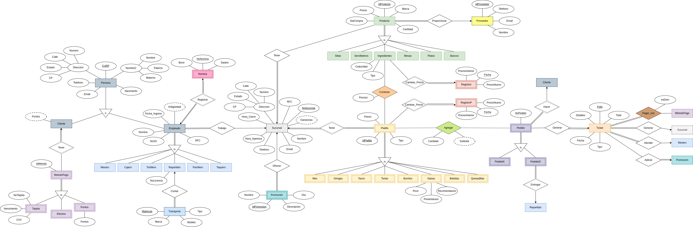

# Taco Riendo

Development of a relational database for restaurant management

- **Tools & Technologies Used:** PostgreSQL, DBMS principles, ER diagrams

Documented the full design process and implemented an optimized database system, ensuring data integrity and scalability.

More Info here, [TacoRiendo](Docs/ProyectoFinal.pdf)

---

 

